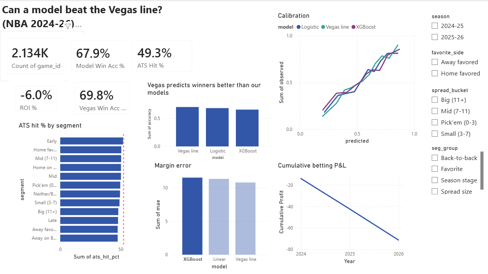

# Why NBA Predictive Models Fail to Beat Vegas Lines

**Hidden variance, market efficiency, and the limits of public-signal models.**

A research-style data project: can machine-learning models predict NBA game
outcomes or spreads better than Vegas closing lines, and if not, *why*?

> **Thesis (modest on purpose):** Models can predict *who wins* about as well as
> experts, but most of the remaining edge against the closing line is too small
> or too noisy to beat the market consistently once you account for the vig.

This is intentionally **not** a "beat Vegas" project. It tests *where* models
succeed, *where* they fail, and *whether* the failure is hidden variance, weak
features, bad validation, or efficient pricing.

## Why this is interesting (the data already shows it)

Across 13,199 regular-season games (2015-16 to 2025-26):

| Metric | Value | Interpretation |
| --- | --- | --- |
| Home win % | 56.5% | A real home-court edge exists |
| Home cover % (ATS) | 49.8% | ...but the market prices it in - a coin flip |
| Over % | 50.4% | Totals are efficiently priced |
| Avg spread vs avg margin | -2.25 vs +2.16 | The line is nearly unbiased |

## Dashboard (Power BI)



Built from `powerbi/exports/`. At a
glance: the model predicts winners well (67.9%) but Vegas is better (69.8%), the
ATS hit rate sits below the 52.4% breakeven across every segment, and a flat-stake
bet on the model loses money over the two test seasons.

## Results (test seasons 2024-25 & 2025-26, 2,134 games)

**Predicting the winner** - models are good, but the market is better:

| Model | Accuracy | ROC-AUC | Brier |
| --- | --- | --- | --- |
| Logistic regression | 67.9% | 0.732 | 0.208 |
| XGBoost | 65.2% | 0.715 | 0.214 |
| **Vegas (implied from spread)** | **69.8%** | **0.764** | **0.196** |

**Predicting the margin** (mean absolute error): linear 11.32, XGBoost 11.51, **Vegas line 10.79**.

**Against the spread** (52.4% = breakeven after the standard -110 vig):

| Strategy | ATS hit % | ROI |
| --- | --- | --- |
| Linear vs spread | 49.2% | -6.2% |
| XGBoost vs spread | 49.3% | -6.0% |
| Elo favorite | 50.9% | -2.9% |
| Always bet home | 50.5% | -3.7% |
| XGBoost, only when edge >= 3 pts | 49.1% | -6.3% |

**Conclusion:** models predict winners about as well as published work (~68%), but
the Vegas line beats them on every accuracy metric and **no betting strategy clears
the vig** - selectivity makes it worse, not better. The remaining edge is too small
and too noisy to overcome transaction costs: the market is efficient.

## Phase 3 - why the models fail (hidden variance)

**How much of a game is even predictable?** (test seasons)

| Predictor | Variance explained | Residual SD |
| --- | --- | --- |
| Vegas closing line | 28.1% | 13.9 pts |
| Our XGBoost | 19.3% | 14.7 pts |

Actual home-margin SD is 16.4 pts. **Even the market explains less than a third of
game-to-game variance** - it leaves a ~14-point per-game noise floor. That floor is
the *hidden variance*: injuries, rotations, foul trouble, and shooting luck that no
pre-game model can see. A better model cannot remove it.

**Is any segment beatable?** No. ATS hit rate stays ~47-52% (below the 52.4%
breakeven) across spread size, favorites/underdogs, back-to-backs, season stage, and
totals. Early-season games are the *least* inefficient slice (51.9% ATS, ROI -0.9%) -
suggestive but still not profitable. Error grows with spread size: big-favorite games
are the noisiest (more garbage time and resting starters). Full breakdown in
[`reports/phase3_findings.md`](reports/phase3_findings.md).

## Tech stack

- **Python** (pandas, NumPy, scikit-learn, XGBoost, statsmodels)
- **DuckDB** for the SQL layer (CTEs, window functions, joins)
- **Power BI** for the results dashboard
- **nba_api** + Kaggle historical odds for data

## Pipeline

```
nba_api  -->  data/games_raw.csv  -.
                                    >--  DuckDB (SQL staging + features)  -->  models  -->  Power BI
Kaggle odds  -->  data/.../*.csv  -'
```

## Project structure

```
NBA/
  data/                 # downloaded data (gitignored - see data/README.md)
  sql/
    01_staging.sql      # clean box scores + odds, map team codes
    02_game_table.sql   # one row per game + betting line + targets
    03_features.sql     # (Phase 1) rolling form, rest, Elo  [planned]
  src/
    config.py           # season scope, paths, team-code map
    01_pull_games.py    # pull box scores from stats.nba.com
    02_build_db.py      # load CSVs -> DuckDB -> run sql/
  notebooks/            # (Phase 2) EDA + modeling  [planned]
  README.md
```

## Reproduce

```bash
pip install -r requirements.txt
# place Kaggle credentials at ~/.kaggle/kaggle.json   (see data/README.md)
python src/01_pull_games.py     # -> data/games_raw.csv
python src/02_build_db.py       # -> nba.duckdb (tables: box, odds, game)
```

## Report sections (final deliverable)

1. Problem statement
2. Why Vegas is hard to beat
3. Data sources
4. Feature engineering
5. Baseline model results
6. ML model results
7. Comparison against Vegas lines
8. Error analysis by game type
9. Hidden-variance discussion
10. Conclusion on market efficiency

## References

- Cheng, Dade, Lipman, Mills - *Predicting the Betting Line in NBA Games* (Stanford CS229). ~68% win accuracy but only ~51-52% ATS (below the 52.4% breakeven).
- *An Examination of Prediction Market Efficiency: NBA Contracts.*
- *Learning, Price Formation and the Early Season Bias in the NBA.*
- *Predicting U.S. National Basketball Game Spreads Using Machine Learning Techniques.*
- *A Data-Driven Approach to Finding an Edge in the NBA Betting Markets.*
